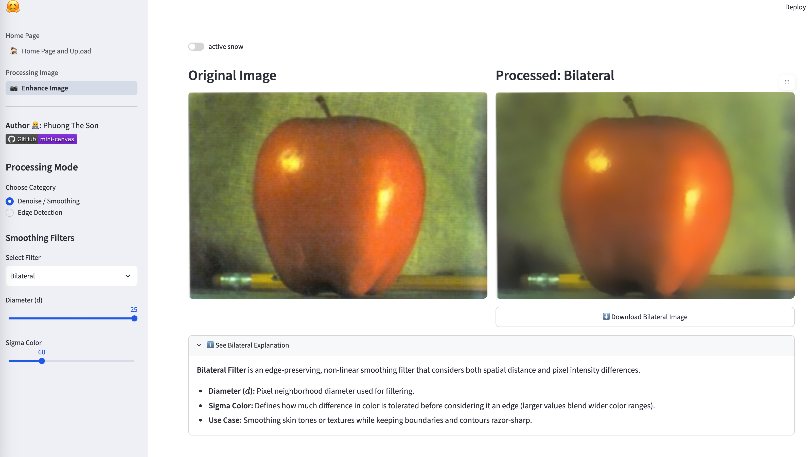
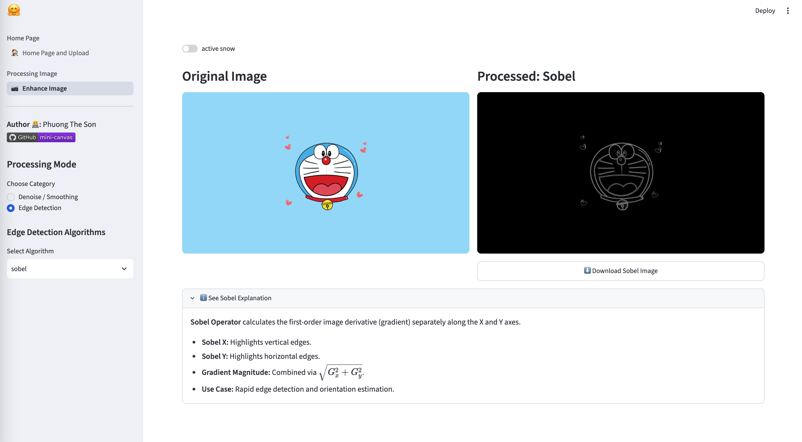

<div align="center">

# 🎨 Mini Canvas: Image Enhancement and Detection

<p align="center">
  <em>An interactive Computer Vision workspace combining classical digital image processing with deep learning inference.</em>
</p>

<!-- Status Badges -->
[](https://www.python.org/)
[](https://streamlit.io/)
[](https://opencv.org/)
[](https://astral.sh/uv)
<!-- [](https://www.docker.com/) -->

</div>

---

## 🤗 Demo

> Demo 1: Denoise
<p align="center">
  
</p>

> Demo 2: Edge Detection

<p align="center">
  
</p>

> Demo 3: Object Detection (coming soon)

---
## 🌟 Key Features

* **Image Enhancement & Denoising:** Gaussian Blur, Bilateral Filter, Median Filter, and 2D Kernel Sharpening.
* **Edge Detection:** Multi-algorithm gradient extraction including Canny, Sobel, and Prewitt filters.
* **YOLO11 Vision Tasks:**
  * 📦 **Object Detection:** Real-time multi-class bounding box localization.
  * 🎭 **Instance Segmentation:** Pixel-level mask segmentation.
  <!-- * 🤸 **Pose Estimation:** Human keypoint tracking and skeleton drawing. -->
* **Multi-Page UI:** Clean navigation architecture powered by `st.navigation`.
<!-- * **Fast Dependency Management:** Managed with **uv** for ultra-fast environment resolution and containerized via **Docker**. -->

---

## 📁 Project Structure

```text
miniCanvas/
├── assets/
│   ├── demo1.png
|   └── demo2.png
|
├── data/                  # Sample test images
├── models/                # Pre-trained YOLO11 weights (.pt)
│   ├── yolo11n.pt
│   └── yolo11n-seg.pt
│   
├── src/                   # Core logic and CV functions
│   ├── enhance_image.py   # OpenCV filtering algorithms
│   └── yolo_service.py    # Model loader and inference engine (coming soon)
├── views/                 # Streamlit page views
│   ├── home.py            # Upload hub and landing view
│   └── manipulation.py    # Enhancement and edge detection view
├── app.py                 # Main entrypoint and router
├── Dockerfile             # Container configuration
├── pyproject.toml         # Project dependencies & metadata
├── uv.lock                # Locked dependency tree
└── run.sh                 # Startup bash script
```
## 🚀 Quick Start
Ensure you have uv installed on your system:

More sources with uv here: https://docs.astral.sh/uv/getting-started/installation/

#### macOS / Linux
`curl -LsSf [https://astral.sh/uv/install.sh](https://astral.sh/uv/install.sh) | sh`

#### Windows (PowerShell)
`powershell -c "irm [https://astral.sh/uv/install.ps1](https://astral.sh/uv/install.ps1) | iex"`

## Local Installation
Clone the repository
```shell
git clone https://github.com/PTSown0222/mini-canvas.git
cd mini-canvas
```

Sync dependencies:
```shell
uv sync
```

Run the application
```shell
bash run.sh
# Or directly via uv:
uv run streamlit run app.py
```

#### TODO:

- [x] Build mini canvas to enhance quality images
- [ ] Reads and Conducts this process: `https://docs.astral.sh/uv/guides/integration/docker/installing-uv`
- [ ] Add more features to enhance quality images such as brightness,...
- [ ] Training and Inference Yolo Model
- [ ] Deploy Model with web apps

#### Requirements
```text
uv add opencv-python-headless
uv add numpy>=2.5.2
uv add streamlit>=1.61.1
```

