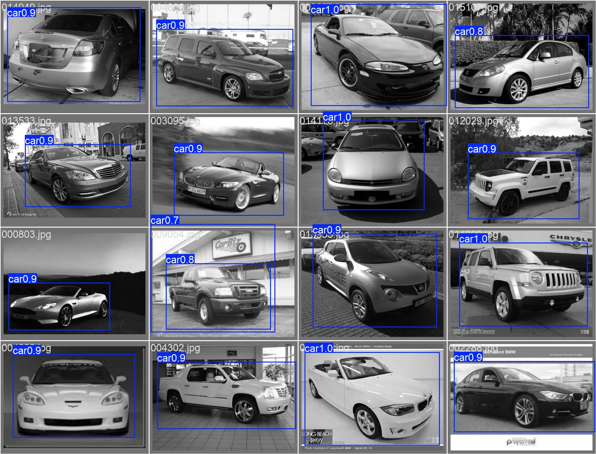
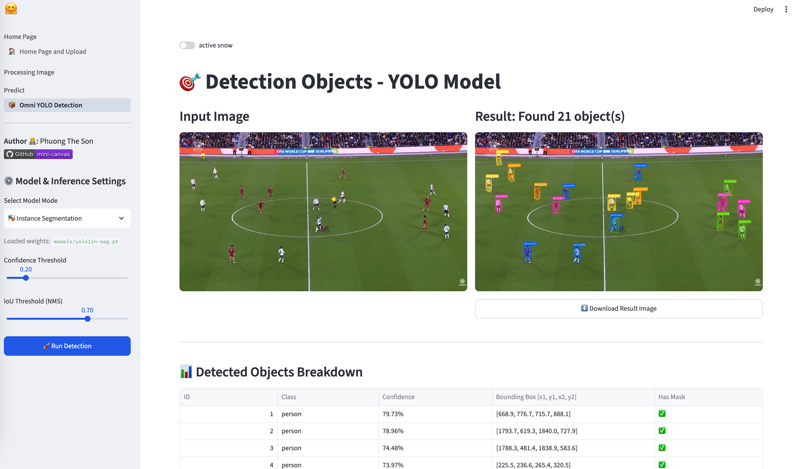

<div align="center">

# 🎨 Mini Canvas: Image Enhancement and Detection

<p align="center">
  <em>An interactive Computer Vision workspace combining classical digital image processing with deep learning inference.</em>
</p>

<!-- Status Badges -->
[](https://www.python.org/)
[](https://streamlit.io/)
[](https://opencv.org/)
[](https://astral.sh/uv)
<!-- [](https://www.docker.com/) -->

</div>

---

## 🤗 Demo

> Demo 1: Denoise
<p align="center">
  
</p>

> Demo 2: Edge Detection
<p align="center">
  
</p>

> Demo 3: Car Detection (Finetune)
<p align="center">
  
</p>

> Demo 4: UI/UX segmentation and object detections
<p align="center">
  
</p>

---
## 🌟 Key Features

* **Image Enhancement & Denoising:** Gaussian Blur, Bilateral Filter, Median Filter, and 2D Kernel Sharpening.
* **Edge Detection:** Multi-algorithm gradient extraction including Canny, Sobel, and Prewitt filters.
* **YOLO11 Vision Tasks:**
  * 📦 **Object Detection:** Real-time multi-class bounding box localization.
  * 🎭 **Instance Segmentation:** Pixel-level mask segmentation.
  <!-- * 🤸 **Pose Estimation:** Human keypoint tracking and skeleton drawing. -->
* **Multi-Page UI:** Clean navigation architecture powered by `st.navigation`.
<!-- * **Fast Dependency Management:** Managed with **uv** for ultra-fast environment resolution and containerized via **Docker**. -->

---

## 📁 Project Structure

```text
miniCanvas/
├── assets/                       # Sample images for testing & demo
│   ├── demo1.png
│   ├── demo2.png
│   ├── demo3.jpg
│   └── demo4.png
├── data/                         # Datasets directory (car_dataset: train/valid/test)
├── models/                       # Checkpoints & model weights
│   ├── yolo11n.pt                # Base COCO detection model
│   ├── yolo11n-seg.pt            # Base COCO instance segmentation model
│   ├── yolo11n_car_detect_20ep.pt# Fine-tuned car detection model
│   └── fasterrcnn_mobilenet_v3.pt# Faster R-CNN model weights
├── notebook/                     # Jupyter notebooks for experiments & training
├── outputs/                      # Training artifacts, charts & evaluation metrics
│   └── car_detection_finetune/
│       ├── BoxF1_curve.png
│       ├── BoxP_curve.png
│       ├── BoxPR_curve.png
│       ├── BoxR_curve.png
│       ├── confusion_matrix.png
│       └── results.csv
├── script/                       # Standalone shell execution scripts
│   ├── run.sh
│   └── run_faster_rcnn.sh
├── src/                          # Core processing modules
│   ├── faster_rcnn/              # Faster R-CNN pipeline implementation
│   ├── yolo11/                   # YOLO11 training, validation & inference scripts
│   ├── basic_adjust.py           # Basic image operations (contrast, brightness)
│   └── enhance_image.py          # Classical CV filters (denoise, smoothing, edges)
├── views/                        # Streamlit multi-page UI views
│   ├── home.py                   # Image upload hub & landing page
│   ├── manipulation.py           # Image filtering & enhancement view
│   └── yolo_detect_view.py       # YOLO11 detection & instance segmentation view
├── app.py                        # Main Streamlit router & entrypoint
├── Dockerfile                    # Containerization config
├── Makefile                      # Command shortcuts (build, run, infer)
├── pyproject.toml                # Project metadata & dependency definitions
└── uv.lock                       # Locked dependency tree (managed with uv)
```
## 🚀 Quick Start
Ensure you have uv installed on your system:

More sources with uv here: https://docs.astral.sh/uv/getting-started/installation/

#### macOS / Linux
`curl -LsSf [https://astral.sh/uv/install.sh](https://astral.sh/uv/install.sh) | sh`

#### Windows (PowerShell)
`powershell -c "irm [https://astral.sh/uv/install.ps1](https://astral.sh/uv/install.ps1) | iex"`

## Local Installation
Clone the repository
```shell
git clone https://github.com/PTSown0222/mini-canvas.git
cd mini-canvas
```

Sync dependencies:
```shell
uv sync
```

Run the application
```shell
bash script/run.sh
# Or directly via uv:
uv run streamlit run app.py
```

#### TODO:

- [x] Build mini canvas to enhance quality images
- [ ] Reads and Conducts this process: `https://docs.astral.sh/uv/guides/integration/docker/installing-uv`
- [x] Add more features to enhance quality images such as brightness,...
- [x] Training and Inference Yolo Model
- [X] Build UI UX
- [ ] Training and Inference Faster-RCNN (MobileNet Backbone)
- [ ] Write API
- [ ] Deploy Model with web apps

#### Requirements
```text
uv add torch>=2.13.0
uv add opencv-python-headless
uv add numpy>=2.5.2
uv add streamlit>=1.61.1
uv add ultralytics>=8.4.138
uv add torchvision>=0.28.0
```

